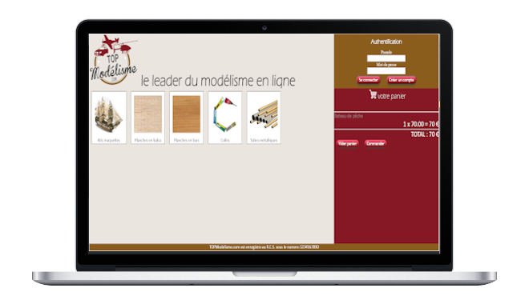

# Site de ventes en ligne

Ce site web a été réalisé en CSS et PHP. Il s'agit d'un site de ventes en ligne avec gestion d'un panier de commande. 

 

NB: Le design du site m'a été imposé par mon professeur. 

WampServer m'a permis de faire fonctionner mon script et d'héberger localement mon site. 

Pour la gestion de la base de données, j'ai utilisé phpMyAdmin.